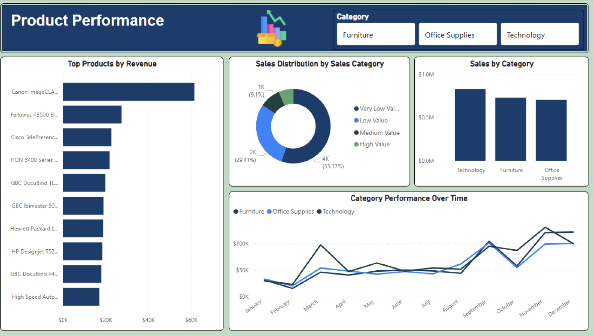

# Retail Sales Analytics Dashboard
End-to-end retail sales analytics project using SQL, Power BI, and DAX to analyze 10,000+ transactions and translate data into clear business insights.

---

## 📊 Project Overview
This project delivers an interactive Power BI dashboard built on cleaned and engineered retail sales data from 2015–2018.  
The objective was to evaluate sales performance, understand customer behavior, analyze product trends, and identify operational improvement opportunities using a structured analytics workflow.

The dashboard is designed for decision-makers to quickly assess performance, identify patterns, and support data-driven planning.

---

## 🛠️ Tools & Technologies
- **SQL (MySQL)** – data cleaning, transformation, and feature engineering  
- **DBeaver** – database management and query execution  
- **Power BI** – dashboard design and interactive data visualization  
- **DAX** – calculated measures and customer value segmentation  

---

## 📁 Dataset
- Retail sales transaction data  
- ~10,000 orders  
- Time period: **2015–2018**  
- Geography: **United States (50 states, 4 regions)**  
- Product categories: **Technology, Furniture, Office Supplies**

---

## 🔧 Data Transformation & Feature Engineering (SQL)
Key data preparation steps included:
- Standardizing date formats and creating time-based dimensions (year, quarter, month, day of week)
- Calculating shipping performance metrics (days between order and shipment)
- Engineering customer behavior features such as order frequency
- Categorizing orders into value tiers (Very Low, Low, Medium, High)
- Designing a customer summary table to support lifetime value analysis

---

## 📈 Dashboard Features

### Page 1: Sales Performance
- KPI cards for total sales ($2.26M), total orders, customers, and average order value  
- Sales trends highlighting strong Q4 seasonality  
- Regional and category-level performance analysis  
- Interactive year and region slicers  

### Page 2: Customer Insights
- Customer segmentation by type (Consumer, Corporate, Home Office)  
- Customer value tier classification using DAX  
- Top 10 customers ranked by lifetime value  
- Revenue contribution by customer segment  

### Page 3: Product Performance
- Top-performing products by revenue  
- Category sales trends over time  
- Distribution of sales by order value  
- Category-level filtering for deeper analysis  

### Page 4: Geographic & Shipping Analysis
- Top 10 states by sales  
- Average shipping time by delivery mode  
- Order distribution by shipping speed (Fast, Standard, Slow)  

---

## 💡 Key Insights
1. **Strong Seasonality** – Sales peak in Q4 (September–December), generating over 40% more revenue than Q1, driven by holiday demand.  
2. **Customer Concentration** – While 68.5% of customers fall into the Low Value segment, they collectively contribute a significant share of revenue, indicating retention and upsell potential.  
3. **Balanced Product Portfolio** – Technology (36.6%), Furniture (31.2%), and Office Supplies (32.2%) contribute relatively evenly to total revenue.  
4. **Geographic Concentration** – California alone accounts for approximately 20% of total sales ($446K), with the West region leading overall performance.  
5. **Shipping Optimization Opportunity** – OOnly 22.13% of orders qualify as Fast shipping, while the majority fall into Standard (38.1%) and Slow (39.8%) categories, with deliveries averaging around five days.

---

## 🎯 Business Recommendations
- Increase inventory planning and marketing efforts in Q3 to prepare for Q4 demand  
- Implement targeted retention strategies for Medium and High Value customers  
- Review fulfillment and logistics processes to improve shipping speed  
- Explore growth opportunities in underperforming regions  

---

## 📊 Dashboard Screenshots

### Sales Performance

### Customer Insights

### Product Performance

### Geographic & Shipping

---

## 👤 Author
**Teslim Thomas**  
Business Analytics Student  
LinkedIn: https://www.linkedin.com/in/teslim-thomas-9b844019a  

---

## 📝 License
This project is for portfolio and educational demonstration purposes.
